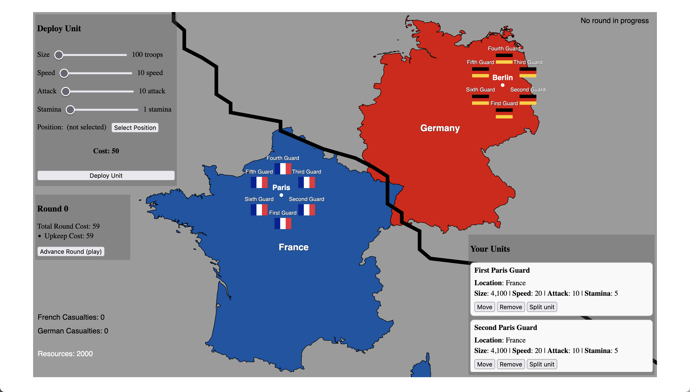

<html lang="en">
  <head>
    <meta charset="UTF-8" />
    <meta name="viewport" content="width=device-width, initial-scale=1.0" />
  </head>
  <body>
    <h1>what is opbp?</h1>
    

      this game is a <b>work in progress</b>! there are significant changes to game mechanics to come. opbp is a
      turn-based (almost) strategy game where you fight a war against your opponent.
    

    <h1>demo gameplay?</h1>
    
yeah! check it out <a href="https://github.com/tiredkangaroo/opbp/raw/refs/heads/main/assets/help/demo.mov">here</a> or just go to the <a href="https://opbp.mechanicaldinosaurs.net/help.html">help page</a>. the demo game was 23 minutes long (video has been sped up 10x).

    <video controls style="width: 100%; height: auto">
      <source src="assets/help/demo.mov" />
      your browser does not support the video tag.
    </video>
    <h1>why is it called opbp?</h1>
    

      this game was originally built in godot and it was titled "opb" because it was going to be a game where you play
      <a href="https://en.wikipedia.org/wiki/Operation_Barbarossa">Operation Barbarossa</a>. i chose to scale back the
      scope of the game, and when i switched to p5, i added a "p" because it was made in p5.   
      the name is not final and i am open to suggestions!
    

    <h1>how do i win/lose?</h1>
    

      the war is fought over victory points. every city is worth a number of victory points and both
      nations start with an equal share (99 each). you win by controlling more than half the map —
      <b>150 victory points</b> — which collapses the enemy's war economy. you lose if the enemy does
      the same to you.
    

    <h1>ok, what's going on?</h1>
    
    <h2>the game</h2>
    we're playing as france, the country in blue. each country starts with six guard units surrounding their capital
    city and a small garrison guard posted on every victory point city. 
    <h2>units</h2>
    

        each unit has a size, speed, attack, and stamina. all of these stats play a role in how the unit performs on the battlefield.
        <ul>
            <li>size is how many troops are in the unit</li>
            <li>speed is how fast a unit can move across the map</li>
            <li>attack is how much damage a unit can inflict on an enemy unit</li>
            <li>stamina affects how the unit degrades over time and in battle</li>
        </ul>
        about a unit:
        <ul>
            <li>they can move across the map</li>
            <li>they can attack enemy units when in contact</li>
            <li>you can merge nearby units to form a larger unit</li>
            <li>they don't always cover the target in just one round</li>
            <li>they degrade over time if in enemy territory and in battle</li>
            <li>they cost resources to deploy, maintain, and move</li>
            <li>upkeep for a unit is greater when it is in enemy territory</li>
            <li>it costs larger units more to move and upkeep</li>
            <li>hovering over a unit shows it in the Your Units panel</li>
        </ul>
    

    <h2>the frontline</h2>
    <ul>
      <li>the frontline is the large black line.</li>
      <li>this line changes as your units move around the map.</li>
    </ul>
    this line is subject to a lot of change, both in the way it's visually represented, and it's signficance.
    <h2>rounds</h2>
    <ul>
        <li>the game is turn-based, and each turn is a round</li>
        <li>each round, you can deploy units, move units, and merge units</li>
        <li>at the end of each round, you gain resources, but you also lose some resources (see the Resources section)</li>
        <li>victory points are tallied when a round ends — hold 150 of them to win the war</li>
    </ul>
    <h2>resources</h2>
    <ul>
        <li>resources are shown in the bottom left corner</li>
        <li>resources are used to deploy units, maintain units (upkeep), and move units</li>
        <li>income every round is purely based on the Victory Point cities you control (capture cities to steal income)</li>
        <li>resources also pay for fortresses and doctrines (see below)</li>
    </ul>
    <h2>victory points, manpower, supply, fortresses & doctrines</h2>
    <ul>
        <li>cities generate income for whoever's army controls them; every city starts with a small garrison guard</li>
        <li>your effective manpower equals <code>victory points controlled ÷ starting victory points</code> — it starts at 1&times;, grows as you conquer, shrinks if you lose ground</li>
        <li>units draw supply lines to their capital; deep pushes weaken and encirclement starves units (red ring)</li>
        <li>build fortresses behind your frontline to anchor defenses; france starts with the Maginot Line</li>
        <li>the Doctrines panel lets you adopt up to two doctrines (Defense in Depth, Blitzkrieg, Industrial Mobilization, Logistics)</li>
    </ul>
  </body>
</html>
